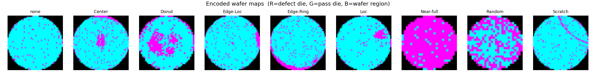
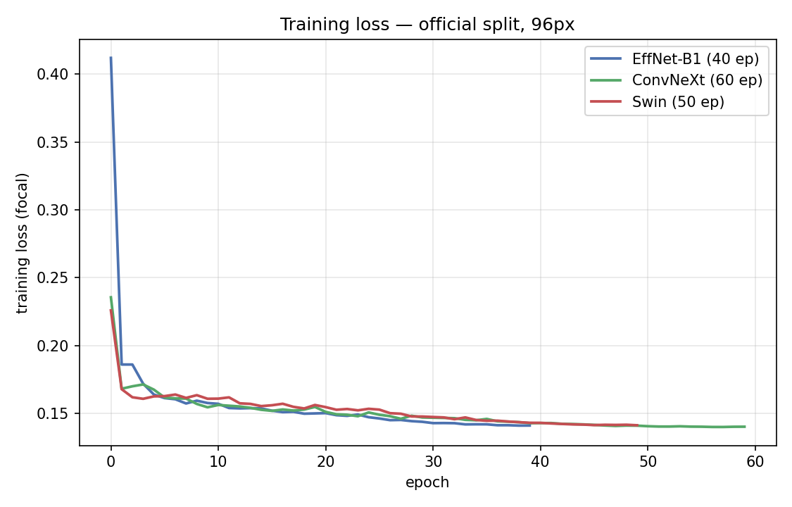
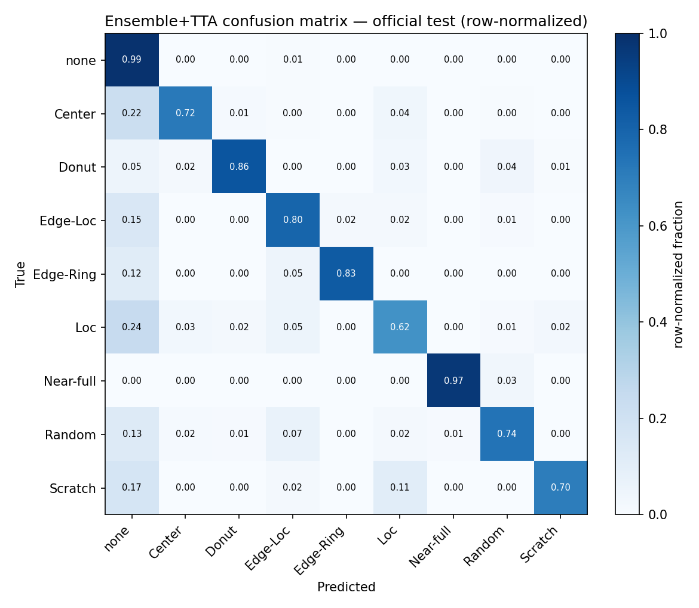
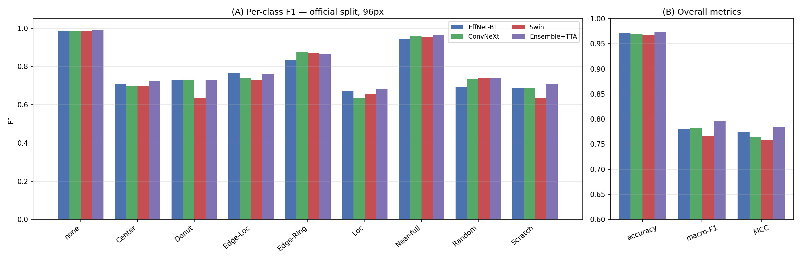
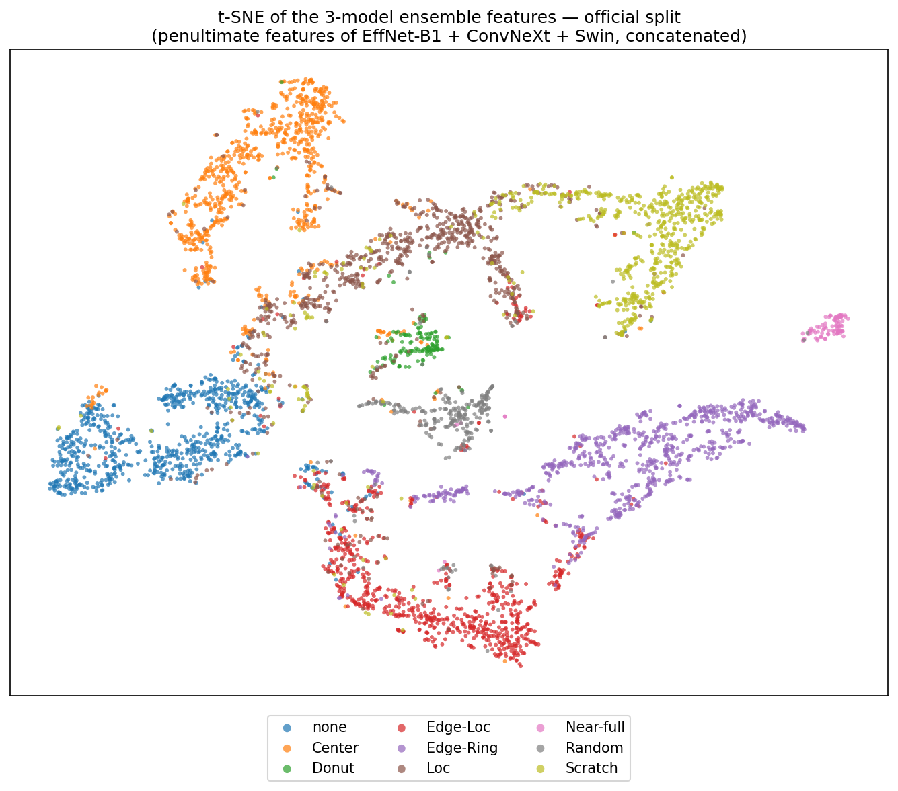
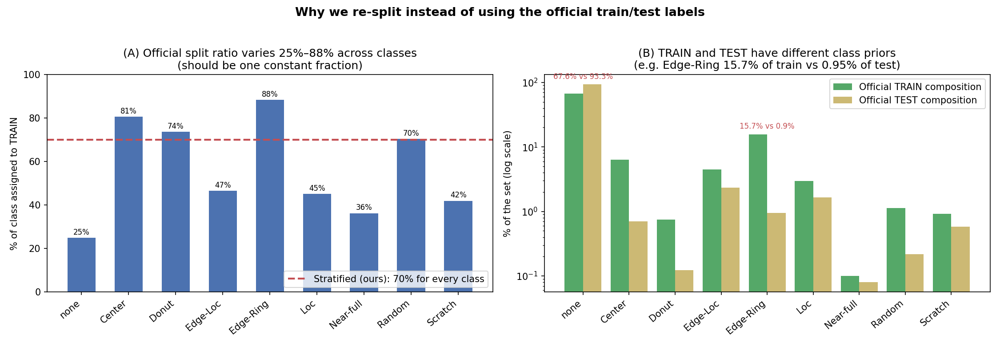

# MIR-WM811K 晶圆缺陷分类

> 半导体晶圆缺陷图谱（Wafer Map）的 9 类自动分类。
> 核心方法 = **三个异构骨干网络集成 + 测试时增强（TTA）**。
> 本文档为最终交付说明，包含全部结果表格、图表解读与方法详解，可直接据此制作 PPT。

---

## 目录
1. [任务背景](#1-任务背景)
2. [数据集与三大难点](#2-数据集与三大难点)
3. [数据预处理：把晶圆图编码成 3 通道图像](#3-数据预处理把晶圆图编码成-3-通道图像)
4. [核心方法：异构三骨干集成 + TTA（重点）](#4-核心方法异构三骨干集成--tta重点)
5. [最终结果](#5-最终结果)
6. [图表解读（figure/ 下所有图）](#6-图表解读figure-下所有图)
7. [为什么有两种数据划分 & 官方划分的问题](#7-为什么有两种数据划分--官方划分的问题)
8. [消融实验：尝试利用无标签数据](#8-消融实验尝试利用无标签数据)
9. [复现命令](#9-复现命令)
10. [目录结构](#10-目录结构)

---

## 1. 任务背景

晶圆缺陷检测是半导体良率控制的关键环节。**WM-811K** 是业界使用最广的公开晶圆数据集，
共 811,457 张晶圆图谱，其中约 **17.3 万张带标注**，分为 **9 类**：

- `none`：无明显失效模式（正常）
- 8 种缺陷模式：`Center`（中心）、`Donut`（环状）、`Edge-Loc`（边缘局部）、
  `Edge-Ring`（边缘环）、`Loc`（局部）、`Near-full`（近满）、`Random`（随机）、`Scratch`（划痕）

**目标**：用有标注数据训练，得到尽可能高的 9 类分类精度。

每张晶圆图是一个二维网格，每个格子（die，芯片单元）取值 `{0=背景, 1=正常芯片, 2=缺陷芯片}`。
不同类别的"缺陷芯片"在晶圆上呈现不同的**空间分布形状**，分类的本质就是**识别这些空间模式**。

---

## 2. 数据集与三大难点

| 难点 | 具体表现 | 我们的应对 |
|------|---------|-----------|
| **① 尺寸不一** | 晶圆从 15×15 到 212×212，共 346 种尺寸，中位数 ~33×33 | 统一编码 + 缩放到定尺图像 |
| **② 极度类别不均衡** | `none` 14.7 万张（85%+），`Near-full` 仅 149 张，相差近 1000 倍 | 加权采样 + Focal Loss + 看 macro-F1/MCC |
| **③ 两种数据划分** | 官方划分训练集小且分布偏移；通用做法是重新分层划分 | 两套都做，公平对比 |

**评价指标说明（重要）**：因为 `none` 占绝对多数，**准确率（accuracy）会被它灌水、虚高**——
一个"全猜 none"的废模型准确率也有 85%。所以**主指标看 macro-F1 和 MCC**：
- **macro-F1**：9 类 F1 的**等权平均**，每个缺陷类同等重要，能暴露稀有类的短板。
- **MCC**（马修斯相关系数）：综合混淆矩阵的相关性，对类别不均衡**最稳健**的单一指标，范围 −1~+1。

---

## 3. 数据预处理：把晶圆图编码成 3 通道图像

每片可变尺寸的晶圆，编码成固定尺寸的 **3 通道图像**（类似 RGB），再喂给 CNN/Transformer：

| 通道 | 含义 | 作用 |
|------|------|------|
| 通道 0（红）| 缺陷芯片 `map==2` | 缺陷在哪 |
| 通道 1（绿）| 正常芯片 `map==1` | 正常区域 |
| 通道 2（蓝）| 晶圆区域 `map>0` | **保留圆盘边界** |

- **为什么要"晶圆区域"通道**：晶圆是圆盘形，`Edge-Ring`/`Edge-Loc` 这类"边缘缺陷"必须知道圆盘
  边界在哪才能判断。这个通道把边界信息显式提供给模型，是区分边缘类的关键。
- **缩放方式**：用 `INTER_AREA`（抗锯齿）缩放，避免细划痕（`Scratch`）在缩小时消失。

**▼ 图：9 类晶圆编码样例**（`figure/wafer_examples.png`）



> **这张图说明什么**：每类取一张样例，用 RGB 显示编码后的图像（红=缺陷芯片、绿=正常芯片、
> 蓝=晶圆盘）。可以直观看到 9 类的空间模式差异——`Center` 缺陷集中在中心、`Edge-Ring` 是一圈、
> `Scratch` 是一条线、`Donut` 是环状等。这就是模型要学会区分的"形状"。

---

## 4. 核心方法：异构三骨干集成 + TTA（重点）

### 4.1 一句话概括

> **训练三个"机制完全不同"的神经网络，让它们各自预测，再把预测平均起来。**
> 因为三者犯的错误不一样，平均后能互相纠正——这就是"异构集成"的威力。

### 4.2 三个骨干网络（逐个解释核心）

| 骨干 | 类型 | 核心机制 | 参数量 |
|------|------|---------|:---:|
| **EfficientNet-B1** | 高效 CNN | 深度可分离卷积 + 复合缩放 | ~6.5M |
| **ConvNeXt-Tiny** | 现代大核 CNN | 7×7 大核卷积 + Transformer 化设计 | ~28M |
| **Swin-Tiny** | 视觉 Transformer | 窗口自注意力 + 移位窗口 | ~28M |

**① EfficientNet-B1（高效卷积网络）**
- 用 **MBConv（深度可分离卷积）**：把普通卷积拆成"逐通道卷积 + 1×1 逐点卷积"，参数和算力大幅减少。
- 用 **复合缩放（compound scaling）**：同时按固定比例放大网络的深度/宽度/分辨率，效率最优。
- 特点：**小卷积核、轻量高效**，关注**局部细节纹理**。是三者里最小的网络。

**② ConvNeXt-Tiny（现代化卷积网络）**
- 是"用 Transformer 的设计思想重新武装的 CNN"：把卷积核放大到 **7×7（大感受野）**，
  并引入 LayerNorm、GELU、倒置瓶颈结构等。
- 特点：**大卷积核 → 一次看到更大范围**，更擅长捕捉**较大尺度的空间结构**。机制上与 EfficientNet
  的"小核"形成互补。

**③ Swin-Tiny（层级视觉 Transformer）**
- 完全不用卷积，而是用**自注意力（self-attention）**：把图像切成小块（patch），
  在**局部窗口内**计算块与块之间的关联，再通过**移位窗口（shifted window）**让信息跨窗口流动。
- 特点：靠注意力建模**全局关系**，归纳偏置与 CNN **根本不同**——这是集成多样性的最大来源。

### 4.3 为什么"异构集成"有效（核心原理）

集成提升的来源是 **误差去相关（error decorrelation）**：

```
若三个模型在同样的样本上犯同样的错  → 平均了也没用
若三个模型犯不一样的错              → 投票/平均能互相纠正  ✅
```

- 三个骨干的**归纳偏置不同**（小核 CNN / 大核 CNN / 注意力 Transformer），
  它们**在不同样本上出错**，所以平均后大部分错误被"投票"救回来。
- 实测：集成的 macro-F1 **显著高于任何单模型**（见结果表，紫色"集成"列几乎每类都 ≥ 最强单模型）。
- 这也是为什么我们刻意选**异构**而非三个同款模型——同款模型错误高度重合，集成几乎没增益。

### 4.4 类别不均衡处理（训练技巧）

- **加权采样器**（WeightedRandomSampler）：按 `1/√(类别样本数)` 采样，让稀有类被充分看到，
  又不至于完全饿死 `none`。
- **Focal Loss + 有效样本数类权重**：down-weight 容易的 `none`，聚焦难分的缺陷类。
- **Label smoothing**：防止过度自信，提升泛化。

### 4.5 数据增强

- **任意角度旋转 + 水平/垂直翻转**。
- 关键依据：**晶圆失效模式对旋转/镜像不变**（中心缺陷转 90° 还是中心、环状转了还是环状），
  所以这是"保标签"的强增强，几乎免费提升泛化。

### 4.6 训练与推理配置

- **骨干**：ImageNet 预训练权重起步；优化器 AdamW + OneCycle 学习率 + **EMA（权重滑动平均）** 让评估更稳。
- **推理增强（TTA, Test-Time Augmentation）**：每张测试图生成 **8 个视图**（4 个旋转 × 是否翻转），
  在 **softmax 概率上平均** → 消除单视角的随机误差。
- **集成**：三个骨干各自 TTA 后的概率再平均 → 取最大值作为预测。
  （即每张图 **3 模型 × 8 视图 = 24 次前向**，全部在概率层面平均。）

---

## 5. 最终结果

### 5.1 两个划分的最佳成绩（集成 + TTA）

| 数据划分 | 测试集大小 | 准确率 | **macro-F1** | MCC |
|---------|:---:|:---:|:---:|:---:|
| **非官方（分层 70/15/15，64+128px）** | 25,943 | 0.9837 | **0.9212** | 0.9394 |
| **官方（Training/Test，96px）** | 118,595 | 0.9726 | **0.7960** | 0.7838 |

> 两个划分 macro-F1 差距巨大（**0.92 vs 0.79**），根因是官方划分**训练集小（仅 5.4 万）+ 训练/测试
> 类别分布偏移严重**（详见第 7 节）。两套都提供，作为公平基准。

### 5.2 非官方（分层）划分 · 每类 F1

> 模型组合：EfficientNet-B1 @64px + ConvNeXt @64px(60轮) + Swin @128px。

```
┌───────────┬───────────┬──────────────┬──────────────┬──────────┐
│   类别    │ EffNet-B1 │ ConvNeXt     │ Swin@128     │ 集成+TTA │
├───────────┼───────────┼──────────────┼──────────────┼──────────┤
│   none    │  0.9918   │    0.9920    │    0.9901    │  0.9927  │
│  Center   │  0.9396   │    0.9376    │    0.9206    │  0.9435  │
│   Donut   │  0.9048   │    0.8875    │    0.9068    │  0.9080  │
│ Edge-Loc  │  0.8768   │    0.8839    │    0.8618    │  0.8952  │
│ Edge-Ring │  0.9846   │    0.9850    │    0.9832    │  0.9863  │
│    Loc    │  0.8551   │    0.8415    │    0.8165    │  0.8624  │
│ Near-full │  0.9565   │    0.9545    │    0.9545    │  0.9545  │
│  Random   │  0.9084   │    0.9042    │    0.9134    │  0.9091  │
│  Scratch  │  0.7880   │    0.7944    │    0.7949    │  0.8387  │
├───────────┼───────────┼──────────────┼──────────────┼──────────┤
│  准确率   │  0.9813   │    0.9818    │    0.9778    │  0.9837  │
│ macro-F1  │  0.9117   │    0.9089    │    0.9047    │  0.9212  │
│    MCC    │  0.9317   │    0.9319    │    0.9203    │  0.9394  │
└───────────┴───────────┴──────────────┴──────────────┴──────────┘
```
**怎么读**：集成（最右列）几乎每类都 ≥ 最强单模型；最难的 `Scratch` 从单模型 ~0.79 提升到 **0.84**。
这就是异构集成的增益。

### 5.3 官方划分 · 每类 F1（最终交付版，96px）

> 模型组合：EfficientNet-B1 / ConvNeXt / Swin 均 @96px。ConvNeXt 已用 lr=1e-3 修复训练不稳。

```
┌───────────┬───────────┬──────────┬─────────┬──────────┐
│   类别    │ EffNet-B1 │ ConvNeXt │ Swin@96 │ 集成+TTA │
├───────────┼───────────┼──────────┼─────────┼──────────┤
│   none    │  0.9881   │  0.9871  │ 0.9864  │  0.9883  │
│  Center   │  0.7103   │  0.6991  │ 0.6963  │  0.7242  │
│   Donut   │  0.7283   │  0.7308  │ 0.6335  │  0.7289  │
│ Edge-Loc  │  0.7664   │  0.7390  │ 0.7305  │  0.7627  │
│ Edge-Ring │  0.8327   │  0.8739  │ 0.8680  │  0.8652  │
│    Loc    │  0.6743   │  0.6359  │ 0.6580  │  0.6801  │
│ Near-full │  0.9418   │  0.9574  │ 0.9524  │  0.9634  │
│  Random   │  0.6911   │  0.7356  │ 0.7409  │  0.7407  │
│  Scratch  │  0.6851   │  0.6878  │ 0.6351  │  0.7105  │
├───────────┼───────────┼──────────┼─────────┼──────────┤
│  准确率   │  0.9720   │  0.9700  │ 0.9681  │  0.9726  │
│ macro-F1  │  0.7798   │  0.7830  │ 0.7668  │  0.7960  │
│    MCC    │  0.7749   │  0.7635  │ 0.7587  │  0.7838  │
└───────────┴───────────┴──────────┴─────────┴──────────┘
```
**怎么读**：同样地，集成 macro-F1（0.7960）> 任何单模型（最高 0.7830）。官方划分整体偏低是因为
训练集小 + 分布偏移，难类（Loc/Scratch/Center）只有 0.68~0.72。

### 5.4 集成命令的运行截图（证据）

- `figure/手动划分的.png`：分层划分集成输出（acc 0.9837 / macroF1 0.9212 / MCC 0.9394）。
- `figure/官方划分的.png`：官方划分集成输出（acc 0.9726 / macroF1 0.7960 / MCC 0.7838）。

---

## 6. 图表解读（figure/ 下所有图）

| 文件 | 类型 | 内容 |
|------|------|------|
| `wafer_examples.png` | 数据图 | 9 类晶圆编码样例（见第 3 节）|
| `official_loss.png` | 训练曲线 | 官方三骨干训练 loss 下降曲线 |
| `official_confusion.png` | 混淆矩阵 | 官方集成的预测 vs 真实 |
| `official_perclass.png` | 柱状图 | 每类 F1（三骨干+集成）+ 整体指标 |
| `official_tsne.png` | 特征可视化 | 集成特征空间的 t-SNE |
| `split_analysis.png` | 分析图 | 官方划分为什么不好（见第 7 节）|
| `官方划分的.png` / `手动划分的.png` | 运行截图 | 集成命令输出（见 5.4）|

### 6.1 训练 loss 曲线（`official_loss.png`）



> **做了什么**：画出官方划分下三个骨干各自的训练 loss（Focal Loss）随 epoch 的下降。
> **说明什么**：三条线都平滑收敛到 ~0.14，说明三个模型都训练充分、无异常。
> （注：ConvNeXt 最初用 lr=2e-3 时这条线中段会飙升发散，调到 lr=1e-3 后才平滑——这是我们修复过的。）

### 6.2 混淆矩阵（`official_confusion.png`）



> **做了什么**：行=真实类别，列=预测类别，按行归一化（每行加起来=1）。对角线 = 判对的比例，越深越好。
> **怎么读**：对角线深 = 准。重点看**非对角线**——它告诉你"错判去了哪"：
> - `Center`/`Loc`/`Scratch` 有 15~22% 被**误判成 `none`**（漏检）；
> - `Edge-Loc` ↔ `Edge-Ring`、`Loc` ↔ `Scratch` 之间互相混。
> **说明什么**：难类的错误主要是"漏判成正常"和"边缘/局部类互相混淆"——这是不均衡 + 缺陷特征相似导致的。

### 6.3 每类 F1 柱状图（`official_perclass.png`）



> **做了什么**：左图 (A) 是 9 类的 F1，每类 4 根柱（EffNet / ConvNeXt / Swin / 集成）；
> 右图 (B) 是整体 accuracy / macro-F1 / MCC 的对比。
> **说明什么**：
> - 紫色"集成"柱几乎在每一类都 **≥ 最强单模型** → 集成确实有效；
> - `none`/`Near-full`/`Edge-Ring` 很高（>0.86），`Loc`/`Scratch`/`Center` 偏低（~0.68~0.72）→ 难类一目了然；
> - 右图整体上集成的 macro-F1/MCC 都最高。

### 6.4 t-SNE 特征可视化（`official_tsne.png`）



> **做了什么**：把三个骨干的**倒数第二层特征拼接**成 2816 维"集成表征"，PCA 降到 50 维后用 t-SNE
> 投影到 2D 平面，每个点是一张晶圆，按真实类别着色（类别均衡采样，让稀有类可见）。
> **说明什么**：
> - **分得开的颜色簇 = 模型学得好的类**（`Center`/`Edge-Ring`/`none`/`Near-full` 各自成团 → 高 F1）；
> - **混在一起的区域 = 易混的难类**（`Loc`/`Edge-Loc`/`Scratch` 互相重叠 → 低 F1）。
> - **核心结论**：难类在**特征层面本身就难以区分**，不是分类头的问题，而是这些缺陷模式内在相似。

---

## 7. 为什么有两种数据划分 & 官方划分的问题

数据集自带"官方划分"（Training 5.4 万 / Test 11.9 万），但它**不适合做均衡的分类基准**，
所以我们额外做了**分层 70/15/15 划分**（深度学习文献的通用做法）。原因见下图：



> **左图 (A)**：官方划分中，每个类被分到训练集的比例**从 25% 到 88% 乱跳**（理应是一个固定比例，
> 红色虚线是我们分层划分的统一 70%）。
> **右图 (B)（对数纵轴）**：官方训练集和测试集的**类别分布根本不一样**——例如 `Edge-Ring` 占训练集
> 15.7%，却只占测试集 0.95%；`none` 占训练 67.6% vs 测试 93.3%。
> **说明什么**：模型在训练集学到的"类别先验"到测试集完全失效 → 官方划分下评估会系统性偏低、不公平。
> 这就是为什么官方划分（0.79）远低于分层划分（0.92）。

---

## 8. 消融实验：尝试利用无标签数据

数据集有 **63.8 万张无标签**晶圆。我们尝试了三类主流方法想利用它们提升精度：
**自监督预训练（SSL，SimMIM 掩码重建）** 和 **协同伪标签（三模型一致才采纳）**。

**官方划分下的各种尝试：**
```
┌─────┬─────────────────────┬───────────┬─────────────┬────────┬──────────┬────────┐
│  #  │        方法         │ 用无标签?  │   分辨率    │ 准确率 │ macro-F1 │  MCC   │
├─────┼─────────────────────┼───────────┼─────────────┼────────┼──────────┼────────┤
│  1  │ ImageNet 异构集成   │     ✗     │   96 统一   │ 0.9731 │  0.7898  │ 0.7894 │
│  2  │ ImageNet 异构集成   │     ✗     │  128 统一   │ 0.9700 │  0.7906  │ 0.7719 │
│  3  │ SSL 自监督预训练    │     ✓     │     96      │ 0.9726 │  0.7866  │ 0.7856 │
│  4  │ 伪标签协同 ≥2/3     │     ✓     │     96      │ 0.9710 │  0.7775  │ 0.7789 │
│  5  │ 伪标签协同 3/3 全票 │     ✓     │     96      │ 0.9715 │  0.7728  │ 0.7772 │
└─────┴─────────────────────┴───────────┴─────────────┴────────┴──────────┴────────┘
```
> 注：上表各行均用最初的 ConvNeXt 配方（lr=2e-3，训练不稳），作为方法间公平对照仍成立。
> 最终交付的 96px 基线已把 ConvNeXt 改 lr=1e-3 修复，集成提升至 **macro-F1 0.7960**（即第 5.3 节的数字）。

**分层划分下的各种尝试：**
```
┌─────┬──────────────────────────────┬───────────┬─────────────┬────────┬──────────┬────────┐
│  #  │             方法             │ 用无标签?  │   分辨率    │ 准确率 │ macro-F1 │  MCC   │
├─────┼──────────────────────────────┼───────────┼─────────────┼────────┼──────────┼────────┤
│  1  │ ImageNet 异构集成            │     ✗     │ 64/128 混合 │ 0.9836 │  0.9244  │ 0.9394 │
│  2  │ ImageNet 异构集成            │     ✗     │   96 统一   │ 0.9834 │  0.9221  │ 0.9382 │
│  3  │ SSL 自监督预训练             │     ✓     │     96      │ 0.9833 │  0.9211  │ 0.9381 │
│  4  │ 伪标签协同 3/3 全票          │     ✓     │     96      │ 0.9839 │  0.9219  │ 0.9403 │
└─────┴──────────────────────────────┴───────────┴─────────────┴────────┴──────────┴────────┘
```

> **结论（重要且诚实）**：在本数据集上，**无标签数据没能带来实质提升**——无论 SSL 还是伪标签，
> 最好持平、最差下降。原因：① 数据本身已被纯监督学得很充分；② 瓶颈是**标注歧义 + 稀有类内在难度**
> （见 t-SNE：难类在特征层面就难分），这是无标签数据无法解决的；③ 伪标签会复制甚至放大 teacher
> 在难类上的错误。**因此最终交付以纯监督异构集成为准。** 这是一个有价值的负面结果。

---

## 9. 复现命令

环境：conda `deepLearning`（已激活时直接用 `python`）。`CUDA_VISIBLE_DEVICES=N` 选 GPU。

```bash
# === 评估两个最佳集成（用已训好的权重，直接出结果）===
# 非官方(分层) 64/128:
python wafer/ensemble.py --data-dir data/processed \
    --ckpts outputs/strat_effb1.pt outputs/strat_convnext.pt outputs/strat_swin.pt
# -> ENSEMBLE+TTA  acc 0.9837  macroF1 0.9212  MCC 0.9394

# 官方 96px:
python wafer/ensemble.py --data-dir data/processed_official \
    --ckpts outputs/official_effb1.pt outputs/official_convnext.pt outputs/official_swin.pt
# -> ENSEMBLE+TTA  acc 0.9726  macroF1 0.7960  MCC 0.7838

# 单模型评估(带每类 F1 + 混淆矩阵):
python wafer/evaluate.py --ckpt outputs/official_swin.pt --data-dir data/processed_official

# === 重新出图 ===
python wafer/report_figures.py --prefix figure/official   # loss / 混淆矩阵 / 每类柱状图
python wafer/tsne_figure.py                                # t-SNE
python wafer/figures.py --fig split                        # 划分分析图
```

从零重训的命令见文末"从零重训"小节（可选）。

---

## 10. 目录结构

```
homework_MIR/
├── wafer/                       代码
│   ├── prepare_data.py          晶圆编码 + 缓存 + 划分(stratified/official)
│   ├── dataset.py               Dataset + 旋转翻转增强
│   ├── model.py                 骨干网络工厂 + Focal Loss
│   ├── trainer.py               训练引擎(加权采样/EMA/OneCycle/Focal)
│   ├── train_{effb1,convnext,swin}.py  三骨干训练脚本(分层 64/64/128)
│   ├── train_generic.py         任意 --model/--size (用于官方 96px)
│   ├── evaluate.py              单模型 TTA 评估
│   ├── ensemble.py              异构集成 + TTA(自动按分辨率加载)
│   ├── report_figures.py        loss / 混淆矩阵 / 每类柱状图
│   ├── tsne_figure.py           t-SNE 特征可视化
│   ├── visualize.py / figures.py 其它报告图
├── data/
│   ├── MIR-WM811K/              原始数据(软链)
│   ├── processed/               分层缓存 labeled_X_64/128 + split (软链)
│   └── processed_official/      官方缓存 labeled_X_96 + split
├── outputs/                     6 个权重 + metrics_*.json + train_*.log
│   ├── strat_{effb1,convnext,swin}.pt      分层最佳(64/64/128)
│   └── official_{effb1,convnext,swin}.pt   官方最佳(96px)
├── figure/                      所有图(见第 6 节)
└── README.md                    本文档
```

每个模型的 `outputs/metrics_*.json` 含完整每轮 loss/F1、每类 F1、混淆矩阵；`train_*.log` 是训练日志。

---

### 附：从零重训（可选）

```bash
# 0. 预处理
python wafer/prepare_data.py --size 64  --workers 48
python wafer/prepare_data.py --size 128 --workers 48
python wafer/prepare_data.py --size 96  --workers 48
python wafer/prepare_data.py --size 96  --split official --outdir data/processed_official

# 1a. 分层三骨干 (64/64/128)
python wafer/train_effb1.py    --tag strat_effb1    --out-dir outputs   # EffNet-B1 @64
python wafer/train_convnext.py --tag strat_convnext --out-dir outputs   # ConvNeXt  @64, 60轮
python wafer/train_swin.py     --tag strat_swin     --out-dir outputs   # Swin      @128

# 1b. 官方三骨干 (96px); 注意 ConvNeXt 用 lr 1e-3
python wafer/train_generic.py --model efficientnet_b1 --size 96 --epochs 40 \
    --data-dir data/processed_official --out-dir outputs --tag official_effb1
python wafer/train_generic.py --model convnext_tiny --size 96 --epochs 60 --lr 1e-3 \
    --data-dir data/processed_official --out-dir outputs --tag official_convnext
python wafer/train_generic.py --model swin_tiny_patch4_window7_224 --size 96 --epochs 50 \
    --bs 192 --lr 8e-4 --pct-start 0.2 --data-dir data/processed_official --out-dir outputs --tag official_swin
```
